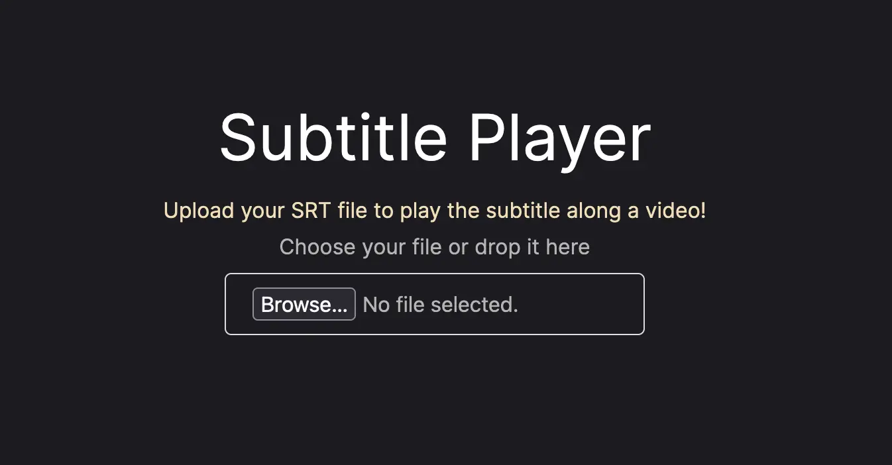
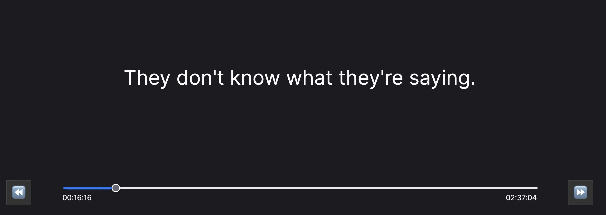

# Subtitle Player

## About The Project

The Subtitle Player is a React web application that allows users to upload their own SRT files and let's them view them while watching the matching video somewhere else, like in a cinema.

Deployed version can be accessed [here at subtitle.ecostack.dev](https://subtitle.ecostack.dev)

### Screenshots:

### Main page

### Subtitle Player


## Development

```bash
npm run dev
```

Open [http://localhost:3000](http://localhost:3000) with your browser to see the result.

You can start editing the page by modifying `app/page.tsx`. The page auto-updates as you edit the file.

This project uses [`next/font`](https://nextjs.org/docs/basic-features/font-optimization) to automatically optimize and load Inter, a custom Google Font.
